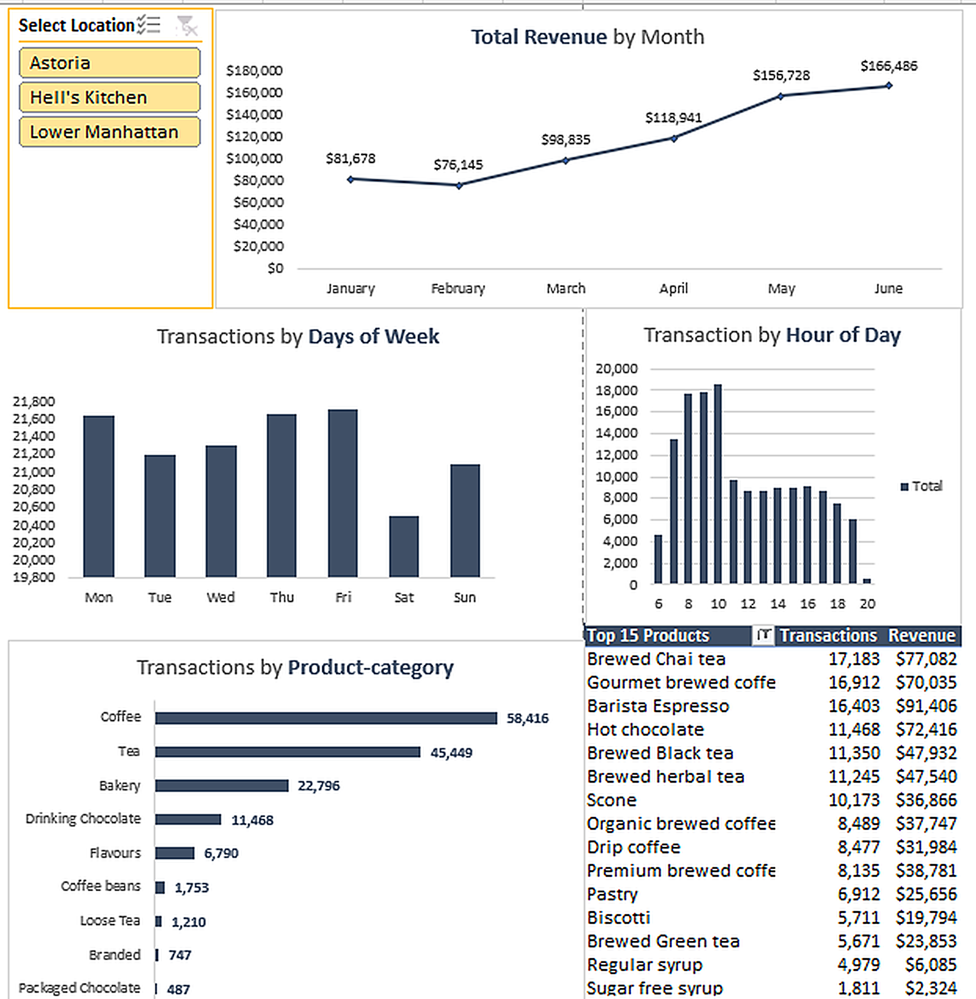

# ☕ Coffee Shop Sales Analysis & Excel Dashboard

An interactive Excel dashboard analyzing six months of transaction data from three NYC coffee shops, built to find out **when, where, and what the business sells most**.

> **Note:** This is a guided project from [Maven Analytics](https://www.mavenanalytics.io/). I followed the course dataset and brief, and built the pivot tables, charts, slicer and dashboard layout myself in Excel.


<!-- Add a screenshot of your dashboard (with the slicer cleared) at images/dashboard.png -->

---

## 📌 Project Overview

| | |
|---|---|
| **Dataset** | 149,116 transactions |
| **Period** | Jan 1 – Jun 30, 2023 (H1 2023) |
| **Locations** | Hell's Kitchen, Astoria, Lower Manhattan |
| **Tool** | Microsoft Excel (formulas, PivotTables, PivotCharts, Slicers) |

**Fields:** transaction ID, date, time, quantity, store ID, store location, product ID, unit price, product category, product type, product detail.

## 🛠️ What I Built

- **Helper columns** with Excel formulas: `Revenue` (qty × unit price), `Month`, `Month Name`, `Weekday`, `Hour`
- **5 PivotTables** feeding the dashboard
- **Interactive location slicer** to filter every chart at once
- **Dashboard visuals:**
  - Total revenue by month (line chart)
  - Transactions by day of week (bar chart)
  - Transactions by hour of day (column chart)
  - Transactions by product category (horizontal bar chart)
  - Top 15 product types table (transactions + revenue)

## 📊 Key Metrics

| Metric | Value |
|---|---|
| Total Revenue | **$698,812.33** |
| Total Transactions | **149,116** |
| Items Sold | **214,470** |
| Average Order Value | **$4.69** |

## 🔍 Key Findings

**1. Revenue is evenly split across stores**

| Store | Revenue | Share | Transactions |
|---|---|---|---|
| Hell's Kitchen | $236,511 | 33.8% | 50,735 |
| Astoria | $232,244 | 33.2% | 50,599 |
| Lower Manhattan | $230,057 | 32.9% | 47,782 |

**2. Drinks drive the business**
Coffee ($269,952) and Tea ($196,406) together make up **66.7%** of revenue. Bakery is the top food category at $82,316 from 23,214 units.

**3. Strong growth over six months**
Monthly revenue went from $81,678 (Jan) to $166,486 (Jun), an increase of **103.8%**. The dataset can't explain the cause (seasonality, new products, or store ramp-up), so this would need more data to confirm.

**4. Morning rush, steady afternoons**
Volume peaks between **8–10 AM** (the 10 AM hour is the busiest), then holds at roughly $40K revenue per hour from noon to 5 PM.

**5. Top revenue items**
Hot chocolate (Sustainably Grown Organic Lg and Dark Chocolate Lg, about $21K each), Latte Rg, Cappuccino Lg, and Morning Sunrise Chai Lg.

## 💡 Recommendations

1. **Staffing:** add barista capacity during 8–10 AM to cut wait times.
2. **Bundling:** pair Latte/Cappuccino orders with Bakery items (scones, pastries) to lift the $4.69 AOV.
3. **Inventory:** prioritize organic hot chocolate, espresso blends and chai, especially ahead of high-demand months.

## ⚠️ Limitations

- Only six months of data, so seasonal patterns can't be separated from growth.
- No cost or margin data, so conclusions are about revenue, not profit.
- Transactions are line items; AOV is revenue per transaction record.

## 📁 Repository Structure

```
├── Coffee_Shop_Sales.xlsx   # Raw data + pivot tables + dashboard
├── images/
│   └── dashboard.png        # Dashboard screenshot
└── README.md
```

## ▶️ How to Use

1. Download `Coffee_Shop_Sales.xlsx` and open it in Excel (desktop version recommended for slicers).
2. Go to the **Dashboard** sheet.
3. Use the location slicer to filter by store.

## 🙏 Credits

Dataset and project brief by [Maven Analytics](https://www.mavenanalytics.io/).

---

**Muhammad Tayyab** · [LinkedIn](https://linkedin.com/in/tayyab-wazir) · [GitHub](https://github.com/Tayyab570)
